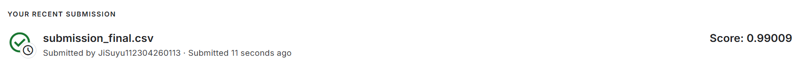

# 机器学习实验：基于 Word2Vec 的情感预测

## 1. 学生信息
- **姓名**：冀苏雨
- **学号**：112304260113
- **班级**：数据1231

> 注意：姓名和学号必须填写，否则本次实验提交无效。

---

## 2. 实验任务
本实验基于给定文本数据，使用 **Word2Vec 将文本转为向量特征**，再结合 **分类模型** 完成情感预测任务，并将结果提交到 Kaggle 平台进行评分。

本实验重点包括：

- 文本预处理（去 HTML、清洗、转小写等）
- Word2Vec 词向量训练与句向量/文档向量表示
- 分类模型训练（Logistic Regression 等）
- 更强基线：TF-IDF（词/字符 n-gram）+ 线性模型
- 集成：stacking / 融合
- 冲榜：Transformer（DistilBERT / RoBERTa / RoBERTa-large）微调与融合

---

## 3. 比赛与提交信息
- **比赛名称**：Word2Vec NLP Tutorial（Bag of Words Meets Bags of Popcorn）
- **比赛链接**：https://www.kaggle.com/competitions/word2vec-nlp-tutorial/overview
- **提交日期**：2026-04-17（Asia/Shanghai）

- **GitHub 仓库地址**：https://github.com/mujganeugene-droid/JiSuyu-112304260113-ML-Experiment2
- **GitHub README 地址**：https://github.com/mujganeugene-droid/JiSuyu-112304260113-ML-Experiment2/edit/main/README.md

> 注意：GitHub 仓库首页或 README 页面中，必须能看到“姓名 + 学号”，否则无效。

---

## 4. Kaggle 成绩
- **Public Score**：0.99009
- **Private Score**（如有）：0.99009
- **排名**（如能看到可填写）：无

- **最终推荐提交文件**：`submission_final.csv`

---

## 5. Kaggle 截图
请在下方插入 Kaggle 提交结果截图，要求能清楚看到分数信息。



> 建议将截图保存在 `images` 文件夹中。  
> 截图文件名示例：`112304260113_冀苏雨_kaggle_score.png`

---

## 6. 实验方法说明

### （1）文本预处理

请说明你对文本做了哪些处理，例如：

- 分词
- 去停用词
- 去除标点或特殊符号
- 转小写

**我的做法：**  

- 使用 BeautifulSoup 去除 HTML 标签（保留纯文本）
- 将非字母字符替换为空格（仅保留 A-Z / a-z）
- 统一转小写并合并多余空白

### （2）Word2Vec 特征表示

请说明你如何使用 Word2Vec，例如：

- 是自己训练 Word2Vec，还是使用已有模型
- 词向量维度是多少
- 句子向量如何得到（平均、加权平均、池化等）

**我的做法：**  

- 使用 gensim 训练 Word2Vec 词向量（可选合并 unlabeled/test 语料）
- 文档向量表示：对文档内词向量取平均（average pooling）得到固定维度向量

### （3）分类模型

请说明你使用了什么分类模型，例如：

- Logistic Regression
- Random Forest
- SVM
- XGBoost

并说明最终采用了哪一个模型。

**我的做法：**  

- Word2Vec 平均向量 / TF-IDF 特征：Logistic Regression
- NBSVM / SVM 风格稀疏特征：SGDClassifier
- Transformer 微调（DistilBERT/RoBERTa/RoBERTa-large）并做融合提升 AUC

---

## 7. 实验流程
1. 从 Kaggle 下载并解压数据（`labeledTrainData.tsv`、`testData.tsv`、`unlabeledTrainData.tsv`）
2. 文本预处理（去 HTML、清洗）
3. 训练特征与模型（Word2Vec / TF-IDF / Transformer）
4. 在测试集上输出正类概率，生成 `submission*.csv`
5. 上传 Kaggle 获取 ROC AUC 分数，迭代优化并做融合

---

## 8. 文件说明

**我的项目结构：**
```text
D:\机器学习实验\EX2\
├─ data_raw\                      # 解压后的数据：labeledTrainData.tsv / testData.tsv / unlabeledTrainData.tsv
├─ src\
│  ├─ make_submission.py           # 传统/集成方案（w2v/tfidf/nbsvm/stack）
│  ├─ make_submission_transformer.py # Transformer 微调生成提交
│  └─ blend_submissions.py         # 融合多个 submission（mean/rank_mean/logit_mean）
├─ artifacts\                      # 传统模型缓存（word2vec / sklearn）
├─ artifacts_transformer*\         # Transformer 训练产物（按不同运行保存）
├─ images\                         # README 截图（Kaggle 成绩截图）
├─ submission_*.csv                # 各种提交文件（Kaggle 上传用）
├─ requirements.txt                # 依赖
└─ README.md
```

---

## 9. 复现方式（命令）

### 9.1 安装依赖
```powershell
cd D:\机器学习实验\EX2
pip install -r .\requirements.txt
```

### 9.2 传统强基线（TF-IDF）
```powershell
python .\src\make_submission.py --data-dir .\data_raw --features tfidf_both --out .\submission_tfidf_both.csv
```

### 9.3 Transformer （RoBERTa-large 示例，需 GPU）
```powershell
python .\src\make_submission_transformer.py --data-dir .\data_raw --model roberta-large --epochs 2 --batch-size 2 --grad-accum 8 --fp16 --grad-checkpointing --valid-ratio 0 --no-eval --out .\submission_roberta_large.csv
```

### 9.4 融合提交（AUC 常用 rank_mean）
```powershell
python .\src\blend_submissions.py --method rank_mean --out .\submission_blend.csv --inputs .\submission_a.csv .\submission_b.csv
```
